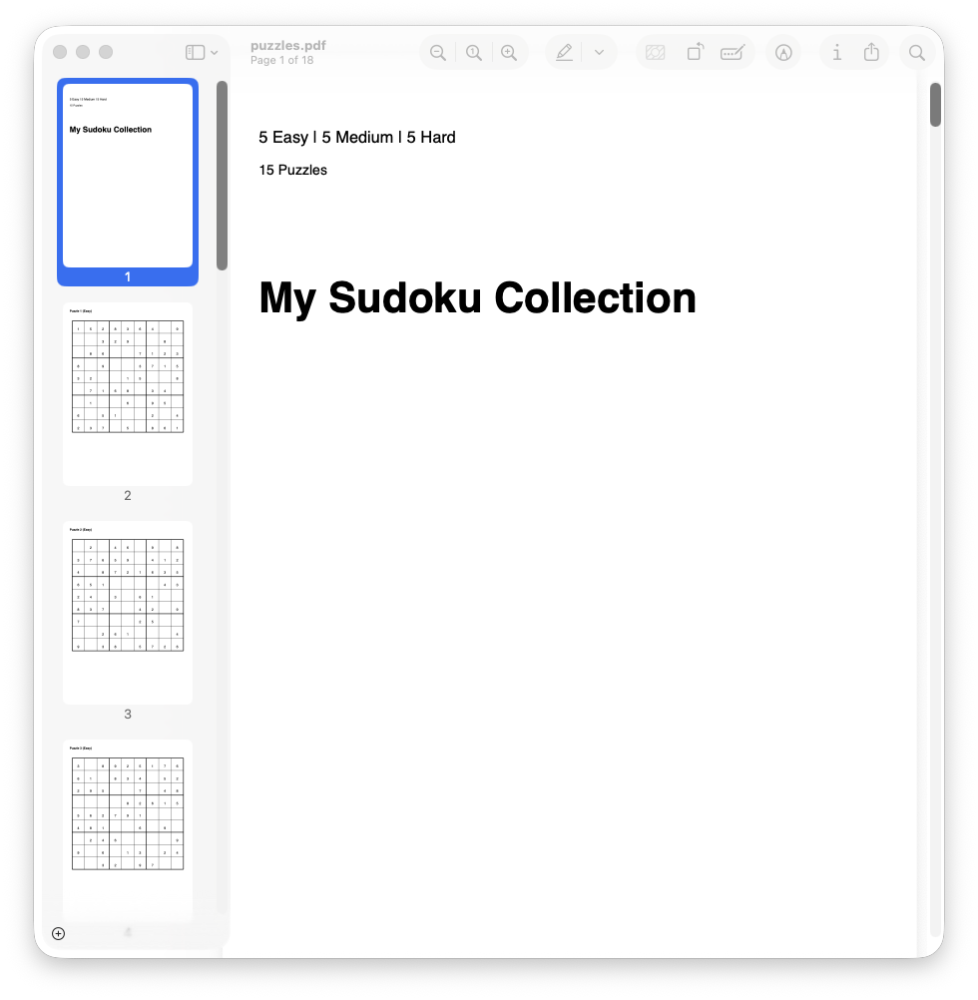
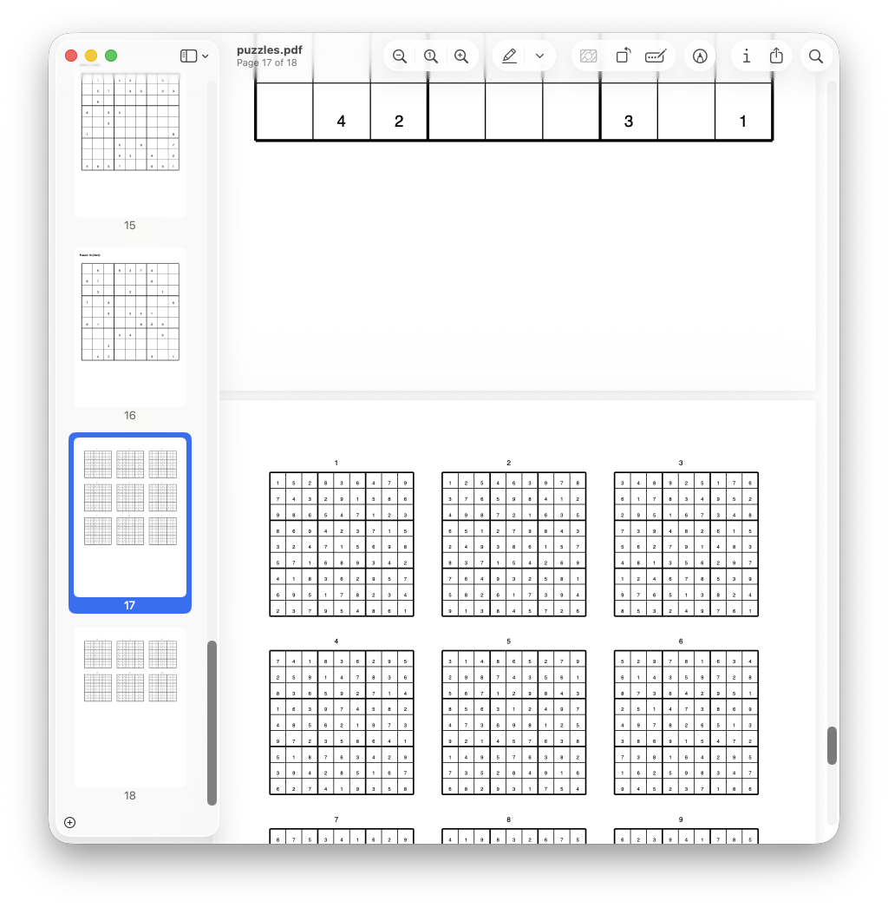

# Sudoku Solver

A CLI tool for solving, generating, and validating Sudoku puzzles using the Dancing Links (DLX) algorithm.

## Installation

```bash
go build -o sudoku .
```

## Commands

### Book

Generate a PDF book of puzzles with solutions.

```bash
./sudoku book puzzles.pdf

# Custom title
./sudoku book puzzles.pdf -t "My Sudoku Collection"

# Custom difficulty counts
./sudoku book puzzles.pdf -e 10 -m 5 -H 3
```





### Solve

Solve a Sudoku puzzle from a string or stdin.

```bash
# From command line
./sudoku solve "530070000600195000098000060800060003400803001700020006060000280000419005000080079"

# From stdin
echo "530070000600195000098000060800060003400803001700020006060000280000419005000080079" | ./sudoku solve

# Custom empty cell character
./sudoku solve -e "." "530070000......"
```

### Generate

Generate a single Sudoku puzzle.

```bash
# Easy puzzle (default)
./sudoku generate

# Medium difficulty
./sudoku generate -d medium

# Hard difficulty
./sudoku generate -d hard

# Custom empty cell character
./sudoku generate -e "0"
```

### Display

Display a puzzle as a formatted grid.

```bash
./sudoku display "530070000600195000098000060800060003400803001700020006060000280000419005000080079"

# Custom empty cell character
./sudoku display -e "." "530......"
```

### IsValid

Check if a puzzle has valid format (no duplicates in rows, columns, or boxes).

```bash
./sudoku isvalid "530070000600195000098000060800060003400803001700020006060000280000419005000080079"
# Output: true
```

## Project Structure

```
.
├── cmd/              # CLI commands
│   ├── root.go       # Root command
│   ├── solve.go      # Solve command
│   ├── generate.go   # Generate command
│   ├── display.go    # Display command
│   ├── isvalid.go    # IsValid command
│   └── book.go       # Book command
├── pkg/
│   ├── solver/       # DLX solver implementation
│   │   └── solver.go
│   └── generator/    # Puzzle generator
│       └── generate.go
├── main.go
└── go.mod
```

## Technical Details

The solver uses Donald Knuth's Algorithm X with Dancing Links (DLX) for efficient exact cover solving. The algorithm achieves O(1) cover/uncover operations, making it extremely fast for solving standard 9x9 Sudoku puzzles.
